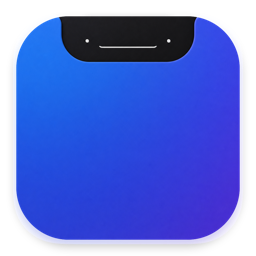
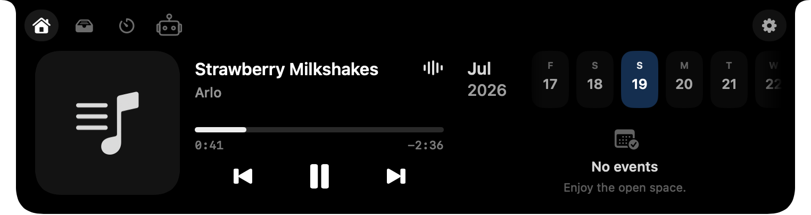
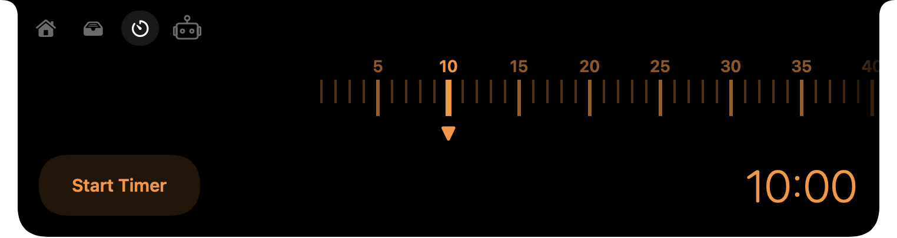
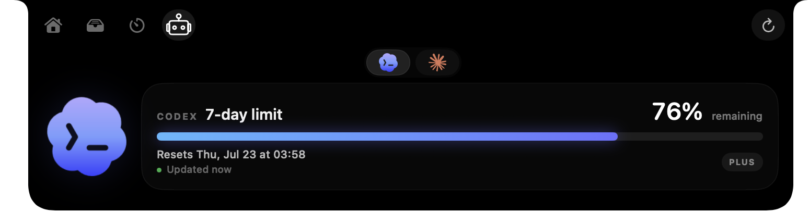

<p align="center">
  
</p>

<h1 align="center">Ledge</h1>

<p align="center">
  A native Dynamic Island for the MacBook notch.
</p>

<p align="center">
  Media controls, Calendar, Clipboard, timers, coding-agent usage, and device updates<br>
  in one polished surface that stays out of the way until you need it.
</p>

<p align="center">
  <a href="https://github.com/aramr/Ledge/actions/workflows/ci.yml"></a>
  <a href="LICENSE"></a>
  <a href="https://github.com/aramr/Ledge/releases/latest"></a>
</p>

## What is Ledge?

Ledge is a native macOS menu-bar app that turns the area around the camera notch into a compact, interactive workspace. It remains visually quiet while idle, surfaces useful information when something is active, and expands into a dashboard when you hover or click.

The interface is built with SwiftUI and AppKit and is designed to feel at home on macOS: smooth notch-aware transitions, native controls, support for every Space, and a synthetic centered island when used on a display without a physical notch.

## Preview

### Media and Calendar

Control active media, view artwork and live playback progress, and check upcoming Calendar events without leaving the current app.

<p align="center">
  
</p>

<table>
  <tr>
    <td width="50%" align="center"><strong>Timer</strong></td>
    <td width="50%" align="center"><strong>Agent usage</strong></td>
  </tr>
  <tr>
    <td></td>
    <td></td>
  </tr>
  <tr>
    <td align="center">Set a 1–120 minute timer with a tactile ruler-style control and compact live countdown.</td>
    <td align="center">See local Codex and Claude seven-day usage, reset timing, and connection status at a glance.</td>
  </tr>
</table>

## Highlights

- **Media:** artwork, track details, progress, previous/play/next controls, and an optional live five-band waveform for Music, Spotify, Safari, and Chromium-based browsers.
- **Calendar:** a scrollable date strip and upcoming Apple Calendar events, with a dedicated full-calendar route.
- **Clipboard:** recent copied text and screenshots, multi-selection, keyboard shortcuts, Quick Look, and drag export. History stays in memory and is discarded when Ledge quits.
- **Timer:** a ruler-style 1–120 minute picker, smooth compact countdown, pause/resume, and an alarm sound.
- **Agentic:** local Codex (including Codex in ChatGPT) and Claude usage limits, reset dates, connection state, and manual refresh.
- **Bluetooth:** compact connection alerts for paired, connected accessories. Apple Watch ecosystem links are excluded, and brief link interruptions do not repeat alerts.
- **Notch-aware design:** uses the physical MacBook notch when available and falls back to a centered island on external displays.
- **Native macOS behavior:** menu-bar-only, no Dock icon, all-Spaces support, full-screen compatibility, and permission-aware integrations.

## Installation

### Homebrew

```sh
brew install --cask aramr/tap/ledge
```

Homebrew installs Ledge into Applications. Future versions can be installed through Homebrew or from **Check for Updates…** in Ledge’s menu-bar menu.

### Direct download

Download `Ledge-<version>.dmg` from the [latest GitHub Release](https://github.com/aramr/Ledge/releases/latest), open it, and drag Ledge into Applications. Every official DMG is Developer ID signed, notarized by Apple, and published with a SHA-256 checksum and GitHub artifact attestation.

Ledge requires macOS 15 or later. It is designed for MacBooks with a camera notch and provides a centered fallback island on other Macs and external displays.

## Build requirements

- macOS 15 or later
- Xcode 26 or later, including the Xcode command-line tools
- A MacBook with a camera notch for the intended experience; Macs and displays without a notch use the centered fallback island
- Git for cloning the repository

Spotify, Apple Music, Safari or a Chromium browser, Apple Calendar, Codex, and Claude are optional. Ledge only activates the integrations that are available on your Mac.

## Install from source

### 1. Clone the repository

```sh
git clone https://github.com/aramr/Ledge.git
cd Ledge
```

You can use SSH instead if your GitHub account is configured for it:

```sh
git clone git@github.com:aramr/Ledge.git
cd Ledge
```

### 2. Build Ledge

From Terminal:

```sh
xcodebuild clean build \
  -project MacDynamicIsland.xcodeproj \
  -scheme Ledge \
  -configuration Release \
  -destination 'generic/platform=macOS' \
  -derivedDataPath DerivedData \
  CODE_SIGNING_ALLOWED=NO
```

Or open `MacDynamicIsland.xcodeproj` in Xcode, select the **Ledge** scheme and **My Mac**, then press **Run**.

### 3. Install and launch

To keep the locally built app in your user Applications folder:

```sh
mkdir -p "$HOME/Applications"
ditto DerivedData/Build/Products/Release/Ledge.app "$HOME/Applications/Ledge.app"
open "$HOME/Applications/Ledge.app"
```

Ledge appears in the macOS menu bar rather than the Dock. Use its menu-bar icon to open Settings, temporarily disable the app, or quit.

> This source-build path is intended for development and personal testing. Public builds should be Developer ID signed and notarized as described in [RELEASE.md](RELEASE.md).

## First launch and permissions

After the welcome flow, macOS may ask for access as each related feature becomes active:

| Permission | Used for |
| --- | --- |
| System Audio Recording | Computing the live media waveform in memory |
| Automation | Reading and controlling compatible media apps such as Spotify |
| Calendar | Showing events from Apple Calendar |
| Bluetooth | Displaying supported device connection alerts |

The live waveform and Bluetooth alerts start enabled and can be turned off independently in Settings. Denying an optional permission does not prevent the rest of Ledge from running.

## Development

Run the unit tests:

```sh
xcodebuild test \
  -project MacDynamicIsland.xcodeproj \
  -scheme Ledge \
  -destination 'platform=macOS' \
  -derivedDataPath DerivedData \
  CODE_SIGNING_ALLOWED=NO
```

Run the complete local security and release gates:

```sh
Scripts/ci.sh
```

Project layout:

- `MacDynamicIsland/App` — lifecycle and menu-bar integration
- `MacDynamicIsland/Core` — app settings, media model, and island state
- `MacDynamicIsland/Services` — media, waveform, Calendar, Clipboard, Bluetooth, Codex, and Claude integrations
- `MacDynamicIsland/UI` — SwiftUI views and AppKit panel/window controllers
- `MacDynamicIslandTests` — model, media, privacy, and integration regression tests
- `Scripts` — security, release, packaging, and distribution verification

## Privacy and distribution

Ledge is local-first. It does not require a Ledge account or backend, does not transmit clipboard or Calendar contents, and never writes captured system audio to disk. Media metadata and agent-usage snapshots are session-only. See [PRIVACY.md](PRIVACY.md) for the complete data-handling notice.

Review [RELEASE.md](RELEASE.md) before creating a public build, and verify the final signed artifact with `Scripts/verify-distribution.sh`.

## Contributing and license

Issues and focused pull requests are welcome. Read [CONTRIBUTING.md](CONTRIBUTING.md) and the [Code of Conduct](CODE_OF_CONDUCT.md) before contributing. Report vulnerabilities privately as described in [SECURITY.md](SECURITY.md).

Ledge is available under the [MIT License](LICENSE).
